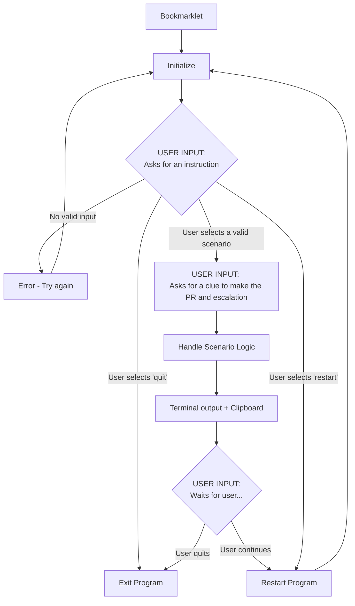
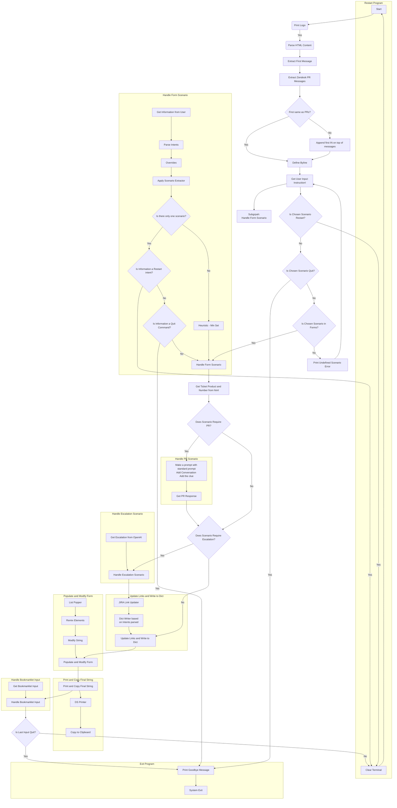

# Wingman - Behind the Veil 

This document serves as a guide to understanding the program's functionality and the process for making edits to its source code. 

## User Journey 

## Forms - Scenarios

The program generates the DS by remixing the elements that make up a DS which are stored in an `elements` dictionary. For example `---` denotes a divider. Anything that can occur in the DS on a separate line is defined separately in elements, and then used to define the forms. The mutable configuration allows for post processing by intentions down the line. Here are the basic scenario forms that are precoded by hand:
1. `l1` - Send to L1
2. `cst` - Send to customer
3. `exsc` - Send to external team (via Side Conversation)
4. `exold` - Send to external team (place back on hold - in escalation)
5. `ex` -  Send to external team (generic - not used)
6. `exjira` - Send to external team (via a Jira) 
7. `exeng` - Send to external team (Engineering)
8. `exb` - Elevate to BU
9. `l2` - Send to L2
10. `clst` - Close ticket 
11. `clsch` - Close chat
12. `sum` - Summarize chat

The code is also what prints to screen in front of the 'Form:'. There are more forms that are generated dynamically such as `no_pr` scenario forms which have an 'n' appended to them, for example, `cstn` for a form that excludes the PR, but generates the rest of the DS elements.

## Intents
Apologies for the confusion. Here's the complete table with the remaining intents and their corresponding outcomes:

| Intent           | Intent  Name          | Outcomes                                                          |
|------------------|-----------------------|-------------------------------------------------------------------|
| no_esc           | No Escalation         | Includes all outcomes except escalation ones:  exjira, exjiran, exsc, exscn         |
| yes_pr           | Yes - PR Required     | Includes all outcomes except clsch - Close chat                      |
| no_pr            | No - PR Not Required  | Includes all form outcomes that end with n (without PR) |
| sum              | Summarize Chat        | sum - Summarize chat                                              |
| vp               | Vendor Partner        | exsc - Send to external team (via Side Conversation) exscn - Send to external team (via Side Conversation, without PR) |
| cf               | Central Finance       | exjira - Send to external team (via a Jira) exjiran - Send to external team (via a Jira, without PR) |
| sc               | Side Conversation     | exsc - Send to external team (via Side Conversation) exscn - Send to external team (via Side Conversation, without PR) |
| bz               | Business Unit         | exjira - Send to external team (via a Jira) exjiran - Send to external team (via a Jira, without PR) |
| acc_mgt          | Account Management    | exsc - Send to external team (via Side Conversation) exscn - Send to external team (via Side Conversation, without PR) exjira - Send to external team (via a Jira) exjiran - Send to external team (via a Jira, without PR) |
| eng              | Engineering           | exeng - Send to external team (Engineering) exengn - Send to external team (Engineering, without PR) |
| bu               | Business Unit         | exb - Elevate to BU exbn - Elevate to BU (without PR)         |
| force_esc        | Force Escalation      | Includes all outcomes except exb and exbn                         |
| force_elevate    | Force Elevate         | Includes all outcomes except exsc, exscn, exjira, exjiran         |
| chat             | Chat                  | clsch - Close chat                                                |
| clst             | Close Ticket          | clst - Close ticket clstn - Close ticket (without PR)          |
| in_esc_update    | In Escalation - Update| exold - Send to external team (place back on hold - in escalation) exoldn - Send to external team ( in escalation, without PR) |
| JIRA(names)      | JIRA keys             | Every JIRA name is loaded into the intent sets with the jira key for example IGBIZOPS, STREETSMART etc. are all intents. Scenarios: exjira - Send to external team (via a Jira) exjiran - Send to external team (via a Jira, without PR)| 

## Functionality and Source Code Editing Guide

**1. Term Search**

The program looks for search terms to confirm if an intent exists. It is designed to favor larger terms under the assumption that they are more specific. This process is defined under the function `encapsulation_check`.

**2. Negation Handling**

The program is built to ignore negated terms. For instance, the term "don't write" should not be parsed as "write" just because there is a search term match and the `negation_check` seems to do a good job of excluding all of these hits. This is crucial to avoid creating null sets in the subsequent Venn diagram. 

However, there is currently no universal logic for intiuting a negative intention from a negation i.e. don't write will not be parsed as write but it also won't automatically exclude the "Yes, send a PR" intent allowing for matches to happen in the rest of the instruction. The don't send a PR intent is  manually incorporates this logic however initializing a contrasting set of search terms by expanding the 'Yes' set with appended negations. A similar thing is at play in  'no_esc'.  

*Note:* The benefit of parsing an automatic negative intention as a negative intent could be worth considering as it could make the program scalable and the Venn sets tighther with just a single line of code. While this would simplify the logic and provide consistency across intentions, we would need to consider the potential implications in terms of unintended consequences. Feedback needed before implementing this change.

**3. Intent Popping Overrides**

These are manually defined to instruct the program that certain options cannot coexist. For example, if the intention is to send a Side Conversation, there is no need to consider 'jira_generic', and thus, that intent is removed.

**4. Venn Diagram Creation**

The program creates a Venn diagram of the options and checks if only a single possibility remains. If more than two possibilities exist, the program applies a default behavior logic.

**5. Form Selection**

The program isolates a specific form.

**6. Intent Value Writing**

The selected intentions write their respective values to the forms.

**7. OpenAI API Call**

The program makes an API call to OpenAI to populate the PR.

**8. Escalation Text Fetching**

Depending on the intention type (escalation or not), the program decides whether to fetch the Escalation text from OpenAI.

**9. Post-Processing**

The program performs post-processing of the form in the list popper.

**10. Copy to Clipboard**

Finally, the processed form is copied to the clipboard for further use.

## Flow to Expand the Program

1. **Search Terms:** Define search terms and assign them a key. Decide if you want partial match or full match. Denote with `searchterm%`, `searchterm`, `%searchterm%`, or `%searchterm`.

2. **Possible Forms:** Define the possible forms associated with this intent. For example, the set associated with intent `send to` includes `l2`, `l1`, `jira`, `sc` but not `send to customer`, `close ticket` or `close chat`. For `vp` it only includes one option `sideconversation`.

3. **Escalation Intent:** If it's an escalation intent, look at the search terms in the `esc` set and decide if this should separately be added to the `esc` set as a search term. This is not necessary if intent will always occur together with regular escalation words like `escalate to` or `send to`.

4. **No PR Intent:** If it's a `no pr` intent, add it to the `no_pr` set.

5. **No ESC Intent:** If it's a `no_esc` intent, don't make an escalation even though it seems from the wording you should.

6. **Opposite Intent:** Define opposite intent and expand it with negations. This won't have to be a step if we decide to apply the expansion across the board.

7. **Overrides:** Define overrides, consider if this intent should be overridden by others if occurring / found together with them and add it to their override set. These are the non-sensical options intuited from search terms but actually can't happen together in the real world.

8. **Default Behavior:** Define default behavior if any. Should this be excluded or be the default in case of conflict?

9. **Form Filling Options:** Define the form filling options in mapping one to one. Remember, higher overrides lower. The program prints conflicts to screen.

10. **Form Changes:** Define if any changes need to happen to the form in `list_popper` which also does insertions. For example, if any part of the form should be included or excluded. You will find that `PR` elements the `divider`, `pr_label`, and the `pr` are removed in the `no_pr` intent to output the form without these elements. Note that forms are built up from "elements" like `pr_label`, `additional_context_label`, `divider` etc defined in the elements dictionary. These elements get remixed by `remixer` into the final output `DS`.

## Short Flow to Add a Simple Intent that Can Write to a Form Field

1. **Search Terms:** Define search terms and assign them a key. Decide if you want partial match or full match. Denote with `searchterm%`, `searchterm`, `%searchterm%`, or `%searchterm`.

2. **Possible Forms:** Define the possible forms associated with this intent. For example, `UDF` intent has only `escalate via jira` as a possibility.

3. **Overrides (Optional):** If search terms are too generic and you think will hit other intentions, define overrides. Consider if this intent should be overridden by others if occurring / found together with them and add it to their override set. These are the non-sensical options intuited from search terms but actually can't happen together in the real world. For example, `Udf` not to worry, but if the unit type was `acc` you would want to put up overrides to exclude everything but `acc` otherwise this wouldn’t fire in the final venn.

4. **Form Filling Options:** Define the form filling options in mapping one to one.

# Function Reference
- `get_resource_path()`: Determines the path where the script is running, defaulting to the config bundled with the executable if necessary.
- `term_print_string(string, indent)`: Wraps and indents a given string for terminal output, respecting the terminal width.
- `print_bright(message, color_code)`: Prints a message to the terminal using a specified ANSI color code for bright colors.
- `print_wrapped(string, color)`: Wraps a given string to the terminal width and prints it with the specified color.
- `print_logo()`: Prints a logo and version information to the terminal with styling.
- `clear_terminal()`: Clears the terminal screen based on the operating system.
- `set_terminal_size(rows, columns)`: Sets the terminal window size to specified rows and columns.
- `preserve_newlines(tag)`: Extracts text from an HTML tag, preserving line breaks and formatting.
- `firstpr_extractor(soup)`: Extracts the first public response from a BeautifulSoup object representing a Zendesk ticket.
- `get_ticket_number(ticket_soup)`: Extracts the ticket number from a BeautifulSoup object representing a Zendesk ticket.
- `get_product(soup)`: Extracts the product name from a BeautifulSoup object representing a Zendesk ticket.
- `scenario_extractor(instruction_string)`: Processes an instruction string to determine the user's intent and applicable scenario.
- `bylinestripper(string)`: Removes signature lines from a given string, typically from email or support ticket responses.
- `ds_printer(finalstring)`: Prints the final output string to the terminal with decorative styling.
- `jira_link_stripper(string)`: Removes JIRA link placeholders from a given string.
- `bu_elevation_stripper(string)`: Replaces a specific HTML table structure with a plain text equivalent in a given string.
- `get_zd_messages(soup, f_pr)`: Extracts and formats Zendesk messages from a BeautifulSoup object.
- `get_intuitPR(model_input, conversation, preseeded_context, seededclue, pr_promptsys, pr_prompt1, pr_prompt2)`: Generates a public response using the OpenAI model based on a conversation and clues.
- `get_intuitIssue(model_input, conversation, response, pr_promptsys)`: Summarizes a customer issue in a single line or short paragraph using the OpenAI model.
- `get_intuitEsc(model_input, conversation, response, dictname, clue, pr_promptsys, pr_prompt1, pr_prompt2, pr_prompt3)`: Generates an escalation message using the OpenAI model based on a conversation, response, and clues.
- `get_name_from_file(dir_path)`: Reads the agent's name from a text file in the program directory.
- `get_gpt_from_file(use_case, dir_path, default_gpt_model)`: Reads the GPT model configuration from a text file in the program directory.
- `get_bu_esc_datatable(product, thedict)`: Creates a rich text table for escalation to the Business Unit (BU) based on a product name and a dictionary of elements.
- `dict_writer(orig_intent_list, global_intents_list, dict_to_update)`: Writes to a dictionary based on intent lists and updates it with specific values.
- `remix_elements(orig_form, dict_of_elements)`: Combines elements from a form template and a dictionary to create a string output.
- `link_updater(productname, intent_list, dict_of_elements)`: Updates links in a dictionary of elements based on the product name and intent list.
- `list_popper(orig_intent_list, orig_list_to_pop)`: Filters a list of form elements based on the intent list, removing or adding elements as needed.
- `modify_string(string, scenario, prodname)`: Customizes a string with scenario-specific modifications and product name insertion.
- `main()`: The main function that orchestrates the script's execution flow, including user interaction and processing logic.

